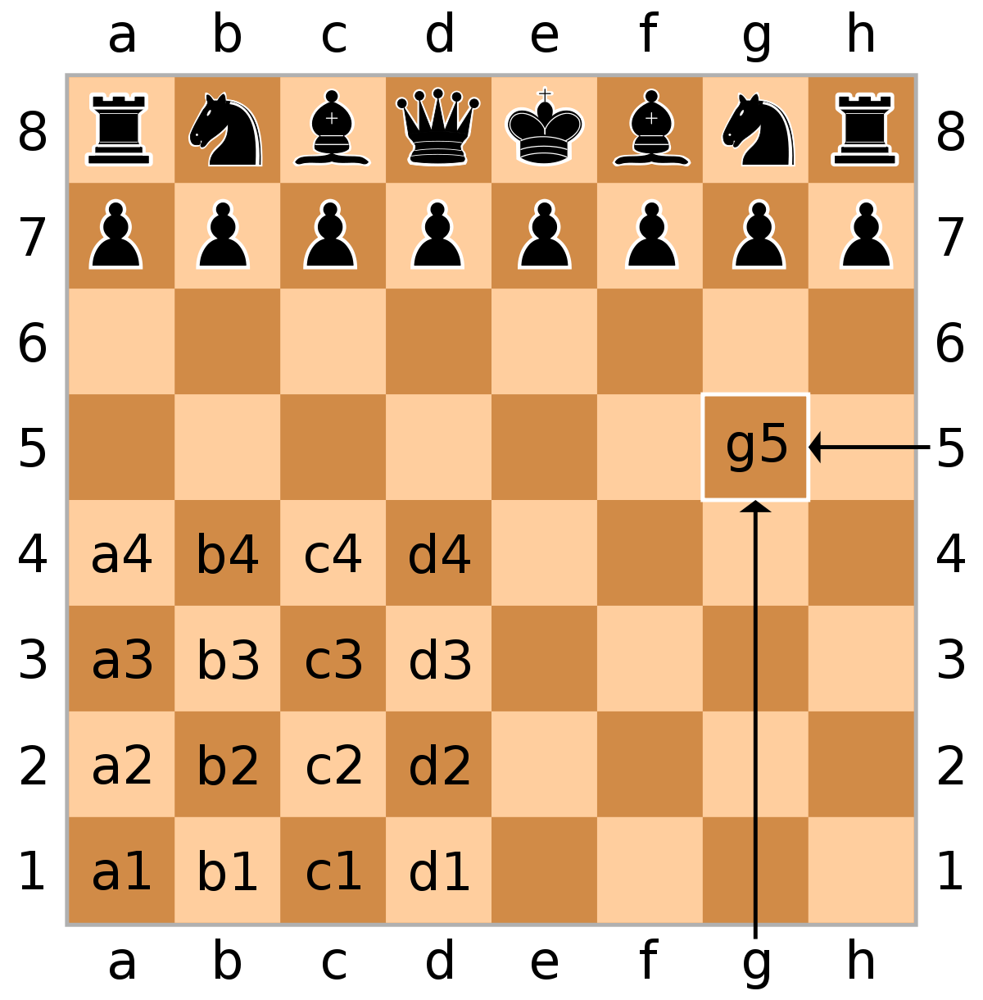

# Final Project - Chess
This document will guide you in conceptually understanding what we are trying to accomplish each step of the way. This document is for conceptual purposes, if you are trying to understand what a specific function will do and how to do that, it might be a good idea to check the comments on the actual skeleton code. However, it would also be helpful to read this document over and understand how things will work in the grand scheme of things.

### Understanding the Game:
The way our game will essentially work is we will create different piece objects that have their own respective properties. For example, a “Rook” piece object will know that it can only move in it’s 2 axis’. So either it moves straight forward, backward, left, or right. Each piece object will have its own properties that determine movement and capturing other pieces.

In addition to the Piece objects, we will also have a 2D array (ask if you need clarification for what this means) that represents our chessboard. Each element in the 2D array (or our chess board)  will be occupied by the piece objects mentioned above. So there will be a black rook piece object on the very first element of our board (the top left piece). And when this piece moves, we will take that object and place it on a different “spot” or “square” on the board.

### Class Construction
To start, we will have a gamestate Class, a piece class, and a class for each different type of piece. Our gamestate class will be responsible for creating the board itself and placing each piece object in it’s correct position at the start of the game, understanding whose turn it is to move, and will effectively move the pieces around. Our piece class will act as a parent to every specific piece on the board - consider what every new instance of a piece needs to “know” about itself. Since every chess piece moves around differently, every Child class of Piece will have its own method to incorporate their movement pattern.

### Week 2 Tasks Documentation: The Move Function
Move function: The move function will actually take each piece and move it to another square on the board. To do this, we will simply be removing the piece off its initial square and placing it on the new square that it would like to move to. At this stage in the process, don’t worry about if this is a valid move for the piece or not, we will get to that next week. Just ensure that a piece is able to move from one spot to another and the board updates appropriately. There are labels on the board that translate to the squares just like a standard chess board (see the diagram below). 

These labels will be inputted into the program to allow movement. For example, to move the very left black pawn forward two squares, you would input a7 → a5. 

### Week 3 Tasks Documentation: Valid Moves
This week, we'll be building on top of move and ensuring that the move the user inputted is actually valid! This is one of the biggest components of the project and deals with a lot of list index calculations, so it can get confusing and complicated very easily, very fast. Additionally, one needs to cater the valid move to each specific piece; i.e. pawns have different valid moves compared to a knight, rook, etc. Be sure to take into consideration the unique movesets of each piece. To make things easier, we've suggested implementing methods for the Piece class that can be generalized, like figuring out the direction of movement as well as if pieces are in between the piece and the position it wants to move.
